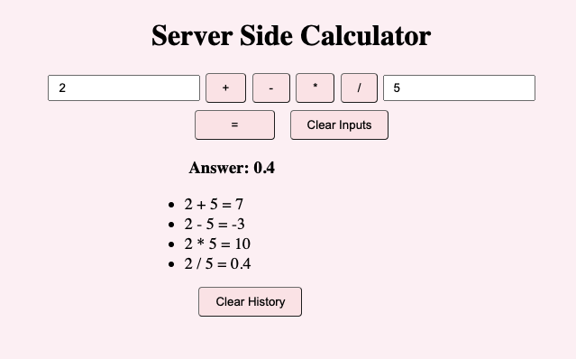

# jQuery Server Calculator

## Description

*Duration: Weekend Project*

This app is a Node.js server side calculator. Users can input two numbers, choose the operator and hit '=' button. It will display the answer in bold at the top of the page, additionally it will also keep track of users calculation history.
Users can clear the input fields with ease and also clear out the history if they so choose.

## Screen Shot
___



### Prerequisites

- Node.js
- jQuery

## Installation
___

1. Fork and clone.
2. Type ```npm init --yes``` into the in-app terminal.
3. Once thats done type ```npm install express``` into the terminal as well.
4. Everything is good to go now! Don't forget to shut down your server when you're done!

## Usage
___

1. Input your numbers into the provided fields.
2. Choose your operator (+, -, *, or /).
3. Hit the '=' button. Your result will be displayed underneath the input fields.
4. If your need to clear out your input fields easily, there is a 'Clear Inputs' button provided.
5. Similarily there is also a 'Clear History' button if you find its getting too big or you just don't need the calculations anymore.

## Built With
___

- jQuery
- JavaScript
- Node.js
- Express
- HTML
- CSS

## Acknowledgement
___

Thanks to Prime Digital Academy who equipped and helped me to make this application a reality. Special thanks to my instructor [Matthew Black](https://github.com/matthew-black)!

## Support
___

If you have suggestions or issues, please email me at [kayla.mir32@gmail.com](mailto:kayla.mir32@gmail.com).
